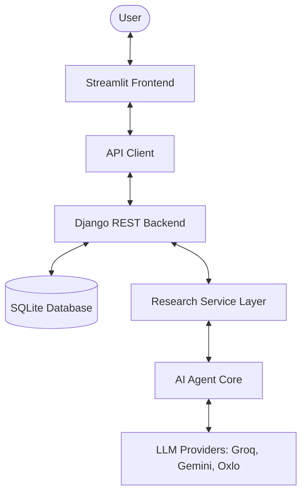

# 🧠 ScholarPulse: AI Research Agent

**Accelerating Discoveries with Collaborative Multi-Agent Intelligence.**

ScholarPulse is an enterprise-grade AI research platform designed to transform complex queries into structured intelligence. By leveraging a distributed architecture and a premium SaaS-inspired interface, it provides researchers with a polished, high-performance dashboard for deep scientific discovery.

---

## ✨ Key Features

- **🚀 Deep Discovery Missions**: Multi-agent search and synthesis engine for exhaustive research.
- **📑 Persistent Library**: Every mission is stored in a structured history for lifetime access.
- **📊 Real-time KPIs**: Direct database aggregation of research impact metrics (Papers found, Searches, Reports).
- **⚙️ Premium Settings**: ChatGPT-inspired split-pane configuration for themes, models, and researcher identity.
- **🎨 Elite SaaS UI**: Aurora Minimal palette with advanced motion, bento-style cards, and glassmorphism.
- **🔒 Privacy First**: Training opt-out controls and persistent local configuration.

---

## 🏗️ Architecture

ScholarPulse utilizes a modern, distributed architecture for scalability and clean separation of concerns.

- **Frontend**: Streamlit + Custom CSS (Vite/SaaS-style aesthetics).
- **Backend**: Django REST Framework (Task management, API endpoints).
- **Storage**: SQLite for persistence and aggregated KPIs.
- **Intelligence**: Multi-provider LLM orchestration for deep reasoning.

---

## 🚀 Getting Started

### Prerequisites
- Python 3.9+
- Django 5.0+

### One-Step Launch
We've provided automated batch scripts to simplify the startup process:

1. **Launch Everything**: Run `start_scholarpulse.bat` to initialize the database, install dependencies, and start both servers.
2. **Access the Dashboard**: Open `http://localhost:8501` in your browser.
3. **Backend Admin**: Managed at `http://localhost:8000/admin`.

---

## ☁️ Cloud Deployment (No Docker)

ScholarPulse is optimized for high-performance hosting on standard Python platforms.

### 1. Backend (Django) on Render.com
- **Build Command**: `pip install -r requirements.txt && python backend/manage.py migrate`
- **Start Command**: `gunicorn scholarpulse.wsgi --chdir backend --bind 0.0.0.0:$PORT`
- **Env Vars**: Set `GROQ_API_KEY`, `DJANGO_SECRET_KEY`, and `DJANGO_DEBUG=False`.

### 2. Frontend (Streamlit) on Streamlit Cloud
- **Main File**: `frontend/app.py`
- **Env Vars**: Set `SCHOLARPULSE_API_URL` to your Render backend URL.

---

## 🛠️ Engineering Highlights

- **API-First Design**: The frontend is entirely decoupled, communicating with the backend via a specialized `ScholarPulseAPI` client.
- **Stateful Persistence**: Settings survive page refreshes through local JSON serialization (`user_settings.json`).
- **Motion-Enhanced UX**: Custom CSS transitions, pulsing glows, and `@media (prefers-reduced-motion)` support for accessibility.
- **Robust Error Handling**: Friendly error cards with hidden technical details and centralized backend logging.

---

## ❄️ Project Status: v1.0 Frozen
ScholarPulse has reached a stable v1.0 milestone. All core architectural and UI features are complete. Future iterations may include Celery for background task queuing and advanced PDF vectorization.

**Built with ❤️ for Modern Researchers.**
