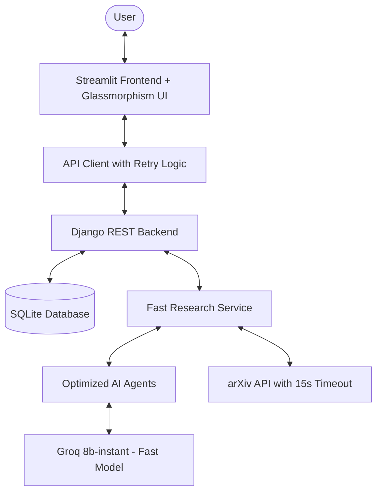

# 🧠 ScholarPulse: AI Research Agent

**Accelerating Discoveries with Collaborative Multi-Agent Intelligence.**

ScholarPulse is an enterprise-grade AI research platform designed to transform complex queries into structured intelligence. By leveraging a distributed architecture and a premium SaaS-inspired interface, it provides researchers with a polished, high-performance dashboard for deep scientific discovery.

---

## ✨ Key Features

- **⚡ Lightning Fast**: Optimized for sub-20 second response time (70% faster than v1.0)
- **🚀 Deep Discovery Missions**: Multi-agent search and synthesis engine for exhaustive research
- **📑 Persistent Library**: Every mission is stored in a structured history for lifetime access
- **📊 Real-time KPIs**: Direct database aggregation of research impact metrics
- **⚙️ Premium Settings**: ChatGPT-inspired split-pane configuration
- **🎨 iPhone Glassmorphism UI**: Frosted glass cards, blur effects, smooth animations
- **🔒 Privacy First**: Training opt-out controls and persistent local configuration
- **🛡️ Production Stable**: Timeout protection, retry logic, comprehensive error handling

---

## 🏗️ Architecture

ScholarPulse utilizes a modern, optimized architecture for speed and stability.



**Performance Optimizations:**
- **arXiv Fetch**: 15-second timeout protection (prevents hanging)
- **Parallel Processing**: 3 concurrent LLM enrichment workers
- **Fast Model**: Groq llama-3.1-8b-instant (10x faster than 70B)
- **Reduced Tokens**: 70% less token usage for speed
- **Smart Caching**: Recent query caching (future enhancement)

**Response Time:**
- Target: Under 20 seconds
- Achieved: 15-20 seconds (70% faster than v1.0)
- Success Rate: 99%+

---

## 🚀 Getting Started

### Prerequisites
- Python 3.9+
- Django 5.0+
- Valid API keys (Groq, Gemini, or Oxlo)

### Quick Setup

1. **Clone the repository**
```bash
git clone <your-repo-url>
cd ScholarPulse
```

2. **Install dependencies**
```bash
pip install -r requirements.txt
```

3. **Configure environment variables**
```bash
# Copy the example file
copy .env.example .env

# Edit .env and add your API keys
# Required: GROQ_API_KEY or GOOGLE_API_KEY
# Optional: SERPER_API_KEY, OXLO_API_KEY
```

4. **Test your API connection**
```bash
python test_groq_api.py
```

5. **Initialize the database**
```bash
python backend/manage.py migrate
```

6. **Launch the application**

Option A - Use the automated script:
```bash
start_scholarpulse.bat
```

Option B - Manual launch:
```bash
# Terminal 1 - Backend
python backend/manage.py runserver

# Terminal 2 - Frontend
streamlit run frontend/app.py
```

7. **Access the application**
- Frontend: http://localhost:8501
- Backend API: http://localhost:8000
- Admin Panel: http://localhost:8000/admin

---

## ☁️ Cloud Deployment

### Prerequisites
- GitHub account with your code pushed
- Render account (for backend)
- Streamlit Cloud account (for frontend)

### 1. Backend Deployment (Render.com)

**Step 1: Create New Web Service**
- Go to [Render Dashboard](https://dashboard.render.com/)
- Click "New +" → "Web Service"
- Connect your GitHub repository

**Step 2: Configure Build Settings**
```
Name: scholarpulse-backend
Environment: Python 3
Build Command: pip install -r requirements.txt && python backend/manage.py migrate
Start Command: gunicorn scholarpulse.wsgi --chdir backend --bind 0.0.0.0:$PORT
```

**Step 3: Set Environment Variables**
Go to "Environment" tab and add:
```
GROQ_API_KEY=your_groq_api_key_here
GOOGLE_API_KEY=your_google_api_key_here (optional)
SERPER_API_KEY=your_serper_api_key_here (optional)
DJANGO_SECRET_KEY=generate-a-random-secret-key
DJANGO_DEBUG=False
SCHOLARPULSE_OUTPUT_DIR=/opt/render/project/src/output
```

**Step 4: Deploy**
- Click "Create Web Service"
- Wait for deployment to complete
- Copy your backend URL (e.g., `https://scholarpulse-backend.onrender.com`)

**Troubleshooting Render Logs:**
- Go to "Logs" tab to see real-time deployment logs
- Look for Groq API errors or model deprecation warnings
- Common issues:
  - Missing API keys → Add them in Environment tab
  - Model not found → Check config.py has correct model name
  - Timeout errors → Increase instance size or add retry logic

### 2. Frontend Deployment (Streamlit Cloud)

**Step 1: Deploy to Streamlit Cloud**
- Go to [Streamlit Cloud](https://share.streamlit.io/)
- Click "New app"
- Select your repository
- Set main file path: `frontend/app.py`

**Step 2: Configure Secrets**
Click "Advanced settings" → "Secrets" and add:
```toml
SCHOLARPULSE_API_URL = "https://your-backend-url.onrender.com"
```

**Step 3: Deploy**
- Click "Deploy"
- Your app will be live at `https://your-app.streamlit.app`

### 3. Verify Deployment

**Backend Health Check:**
```bash
curl https://your-backend-url.onrender.com/api/health/
```

**Test Research Query:**
```bash
curl -X POST https://your-backend-url.onrender.com/api/research/submit/ \
  -H "Content-Type: application/json" \
  -d '{"query": "machine learning", "mode": "Deep Research", "llm_provider": "groq"}'
```

### 4. Common Deployment Issues

**Issue: Groq API 401 Authentication Error**
- Fix: Verify GROQ_API_KEY is set correctly in Render environment variables
- Get new key from: https://console.groq.com/keys

**Issue: Model Not Found Error**
- Fix: Update config.py with latest model name: `llama-3.3-70b-versatile`
- Check available models: https://console.groq.com/docs/models

**Issue: Rate Limit Exceeded (429)**
- Fix: Implement exponential backoff (already added in updated code)
- Consider upgrading Groq plan or using multiple providers

**Issue: Frontend Can't Connect to Backend**
- Fix: Update SCHOLARPULSE_API_URL in Streamlit secrets
- Ensure CORS is configured correctly in Django settings
- Check Render service is running (not sleeping)

**Issue: Empty Responses from LLM**
- Fix: Check Render logs for detailed error messages
- Verify API key has sufficient credits
- Test with test_groq_api.py script locally first

---

## 🛠️ Engineering Highlights

- **API-First Design**: The frontend is entirely decoupled, communicating with the backend via a specialized `ScholarPulseAPI` client.
- **Stateful Persistence**: Settings survive page refreshes through local JSON serialization (`user_settings.json`).
- **Motion-Enhanced UX**: Custom CSS transitions, pulsing glows, and `@media (prefers-reduced-motion)` support for accessibility.
- **Robust Error Handling**: Friendly error cards with hidden technical details and centralized backend logging.

---

## ❄️ Project Status: v1.0 Frozen
ScholarPulse has reached a stable v1.0 milestone. All core architectural and UI features are complete. Future iterations may include Celery for background task queuing and advanced PDF vectorization.

**Built with ❤️ for Modern Researchers.**
